# Algorithm and Flowchart Workshop

Pseudocode and flowcharts for all workshop questions. Flowcharts use Mermaid and render in Markdown viewers that support Mermaid.

## 1. Check Even or Odd Number

### ✔ Pseudocode

```text
START
    INPUT number
    IF number MOD 2 = 0 THEN
        OUTPUT "Even"
    ELSE
        OUTPUT "Odd"
    ENDIF
END
```

### ✔ Flowchart

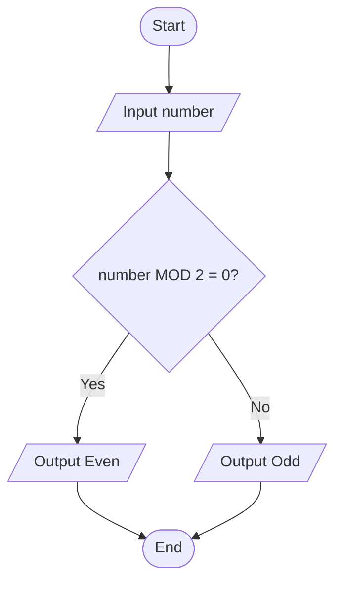

## 2. Calculate Total and Average Marks

### ✔ Pseudocode

```text
START
    INPUT mark1, mark2, mark3
    total ← mark1 + mark2 + mark3
    average ← total / 3
    OUTPUT total, average
END
```

### ✔ Flowchart

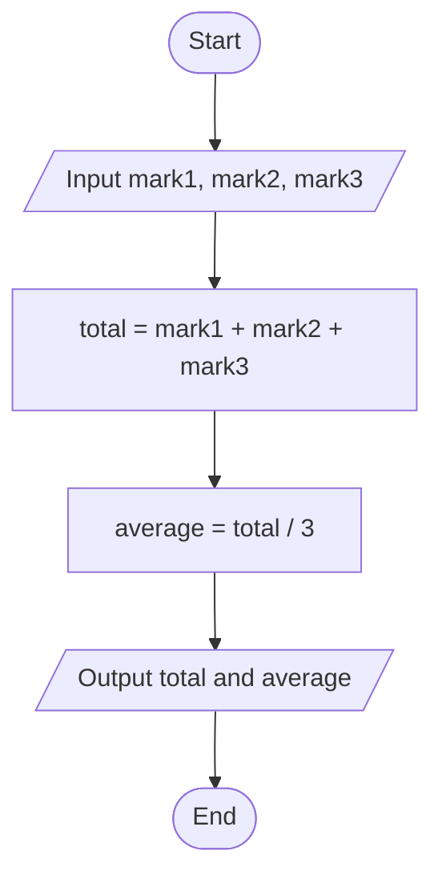

## 3. Display Multiplication Table

### ✔ Pseudocode

```text
START
    INPUT number
    counter ← 1
    WHILE counter ≤ 10
        OUTPUT number, " × ", counter, " = ", number × counter
        counter ← counter + 1
    ENDWHILE
END
```

### ✔ Flowchart

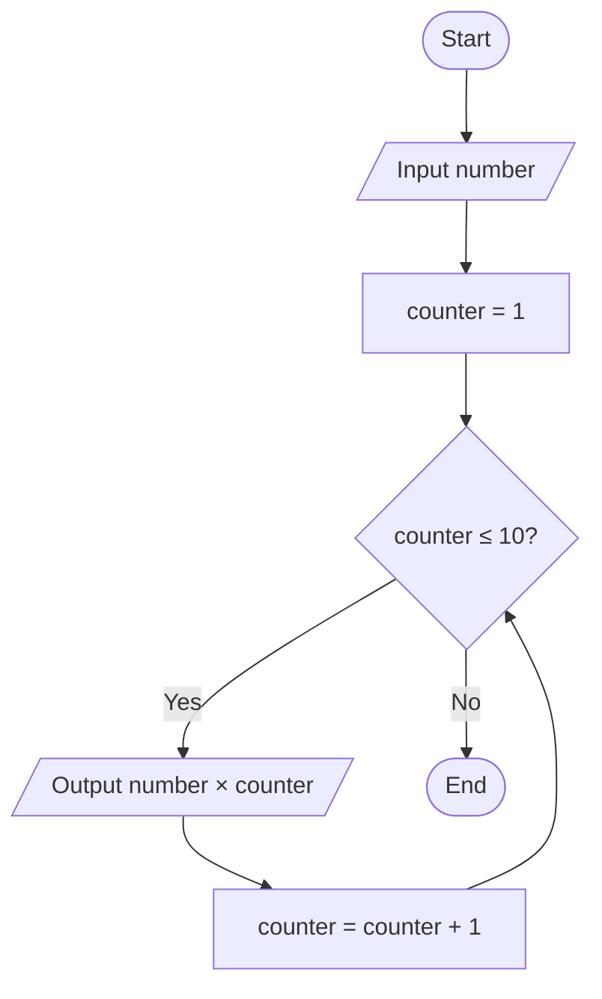

## 4. Positive, Negative, or Zero Check

### ✔ Pseudocode

```text
START
    INPUT number
    IF number > 0 THEN
        OUTPUT "Positive"
    ELSE IF number < 0 THEN
        OUTPUT "Negative"
    ELSE
        OUTPUT "Zero"
    ENDIF
END
```

### ✔ Flowchart

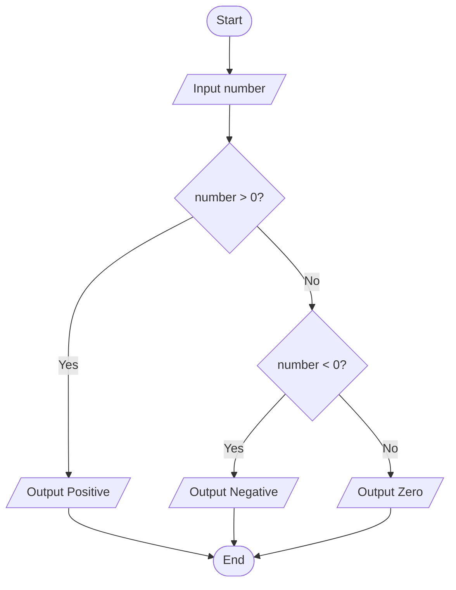

## 5. Simple Interest Calculator

### ✔ Pseudocode

```text
START
    INPUT principal, rate, time
    simpleInterest ← (principal × rate × time) / 100
    OUTPUT simpleInterest
END
```

### ✔ Flowchart

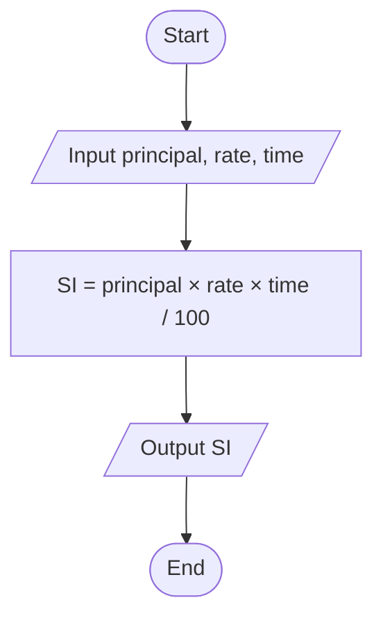

## 6. Average Temperature Calculation

### ✔ Pseudocode

```text
START
    total ← 0
    day ← 1
    WHILE day ≤ 7
        INPUT temperature
        total ← total + temperature
        day ← day + 1
    ENDWHILE
    average ← total / 7
    OUTPUT average
END
```

### ✔ Flowchart

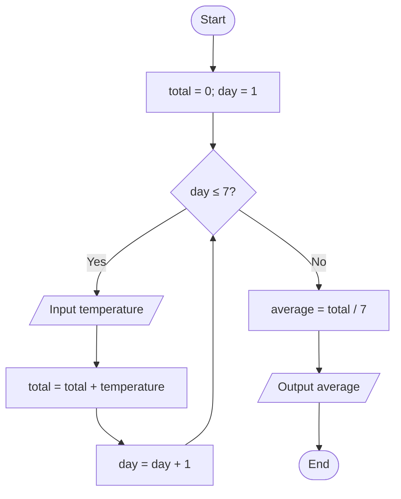

## 7. Calculate Area of a Rectangle

### ✔ Pseudocode

```text
START
    INPUT length, width
    area ← length × width
    OUTPUT area
END
```

### ✔ Flowchart

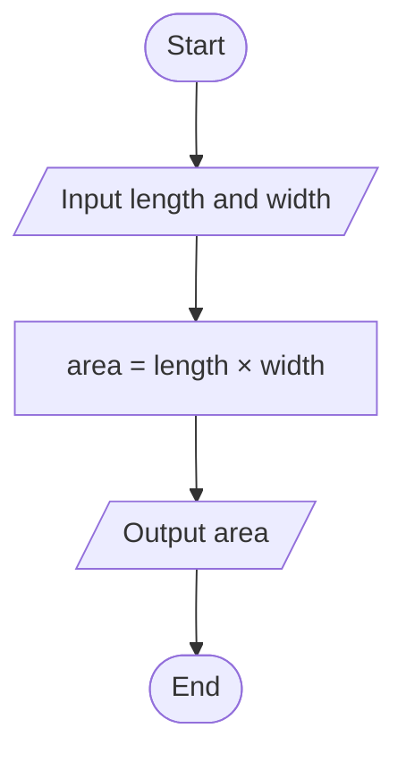

## 8. Determine Pass or Fail

### ✔ Pseudocode

```text
START
    INPUT average
    IF average ≥ 50 THEN
        OUTPUT "Pass"
    ELSE
        OUTPUT "Fail"
    ENDIF
END
```

### ✔ Flowchart

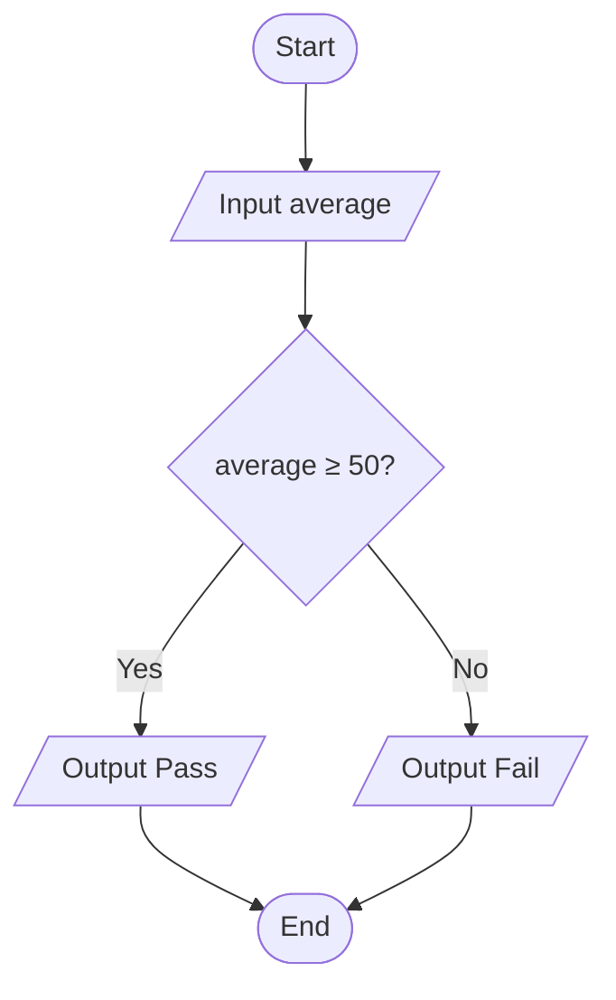

## 9. Calculate Factorial of a Number

This algorithm assumes the input is a non-negative integer.

### ✔ Pseudocode

```text
START
    INPUT number
    factorial ← 1
    counter ← 1
    WHILE counter ≤ number
        factorial ← factorial × counter
        counter ← counter + 1
    ENDWHILE
    OUTPUT factorial
END
```

### ✔ Flowchart

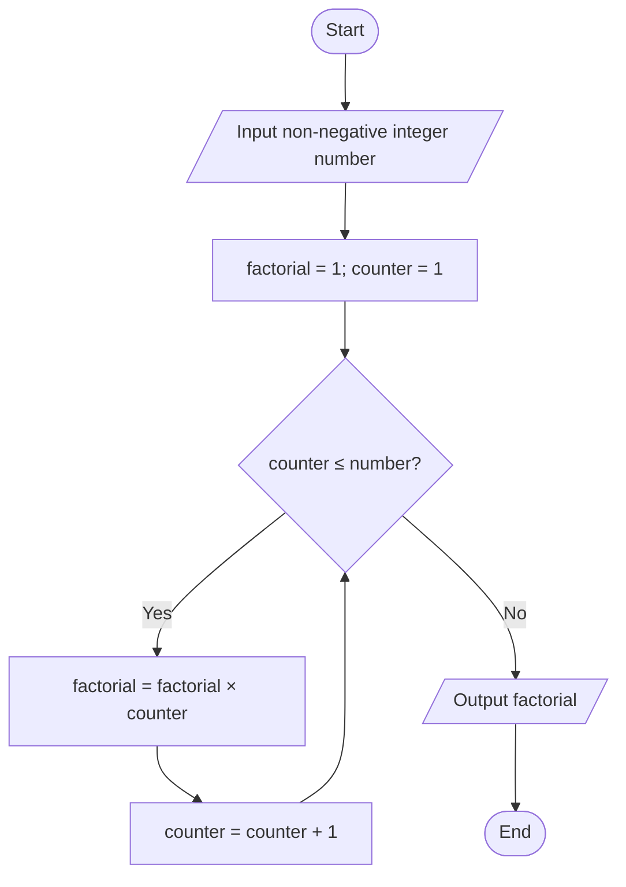

## 10. Calculate Discount on Purchase

### ✔ Pseudocode

```text
START
    INPUT amount
    IF amount > 1000 THEN
        discount ← amount × 0.10
    ELSE
        discount ← 0
    ENDIF
    finalAmount ← amount - discount
    OUTPUT discount, finalAmount
END
```

### ✔ Flowchart

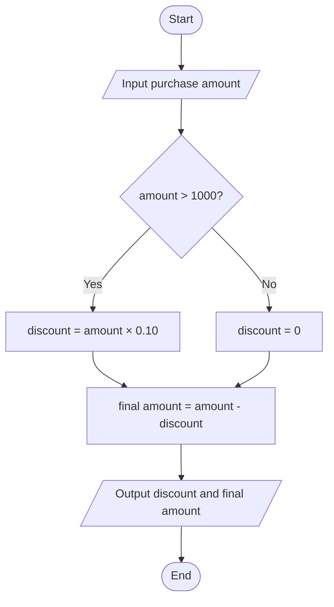

## 11. Online Shopping Delivery Eligibility

### ✔ Pseudocode

```text
START
    INPUT amount
    IF amount ≥ 500 THEN
        OUTPUT "Free Delivery"
    ELSE
        OUTPUT "Delivery Charge Applies"
    ENDIF
END
```

### ✔ Flowchart

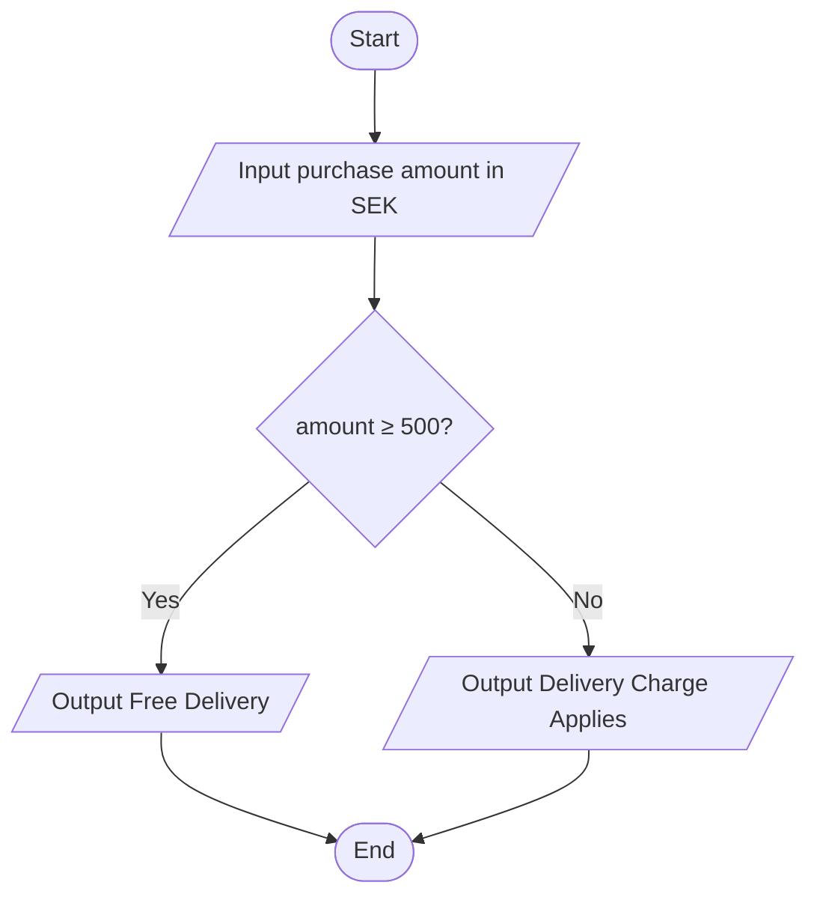

## 12. Employee Salary and Bonus Calculator

### ✔ Pseudocode

```text
START
    INPUT monthlySalary, yearsOfService
    IF yearsOfService ≥ 5 THEN
        bonus ← monthlySalary × 0.10
    ELSE
        bonus ← monthlySalary × 0.05
    ENDIF
    totalSalary ← monthlySalary + bonus
    OUTPUT bonus, totalSalary
END
```

### ✔ Flowchart

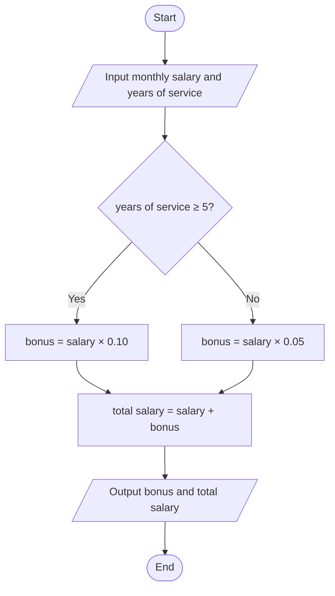

## 13. Mobile Data Usage Monitor

### ✔ Pseudocode

```text
START
    INPUT dataLimit, dataUsed
    IF dataUsed > dataLimit THEN
        exceeded ← dataUsed - dataLimit
        OUTPUT "Limit exceeded by", exceeded
    ELSE
        remaining ← dataLimit - dataUsed
        OUTPUT "Data remaining", remaining
    ENDIF
END
```

### ✔ Flowchart

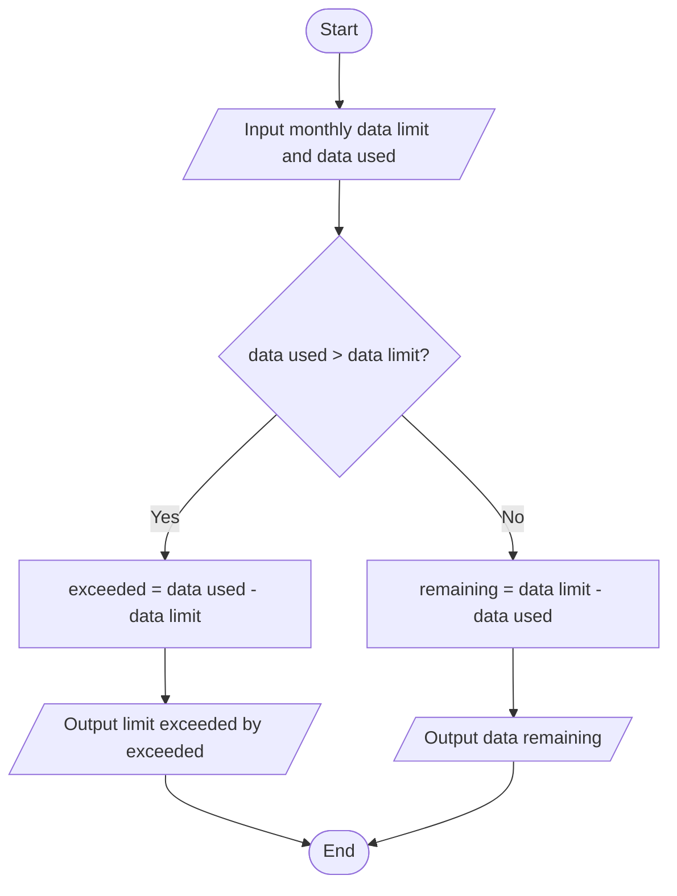

## 14. Login System (Maximum 3 Attempts)

### ✔ Pseudocode

```text
START
    correctPassword ← stored password
    attempts ← 0
    WHILE attempts < 3
        INPUT password
        IF password = correctPassword THEN
            OUTPUT "Access Granted"
            STOP
        ENDIF
        attempts ← attempts + 1
    ENDWHILE
    OUTPUT "Account Locked"
END
```

### ✔ Flowchart

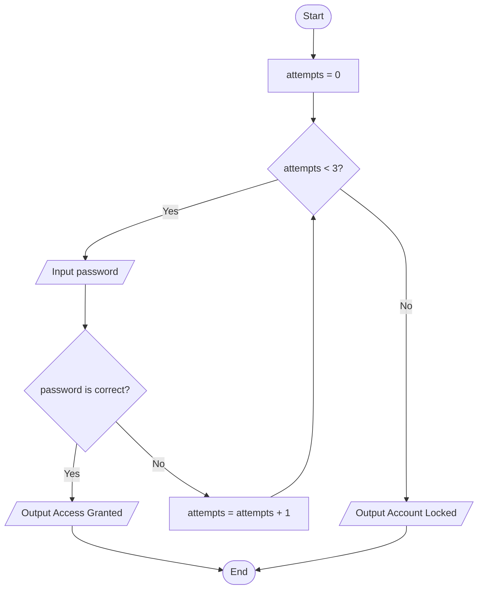

## 15. Store Checkout with Multiple Items

### ✔ Pseudocode

```text
START
    INPUT itemCount
    total ← 0
    item ← 1
    WHILE item ≤ itemCount
        INPUT itemPrice
        total ← total + itemPrice
        item ← item + 1
    ENDWHILE
    IF total > 5000 THEN
        discount ← total × 0.15
    ELSE
        discount ← 0
    ENDIF
    finalTotal ← total - discount
    OUTPUT total, discount, finalTotal
END
```

### ✔ Flowchart

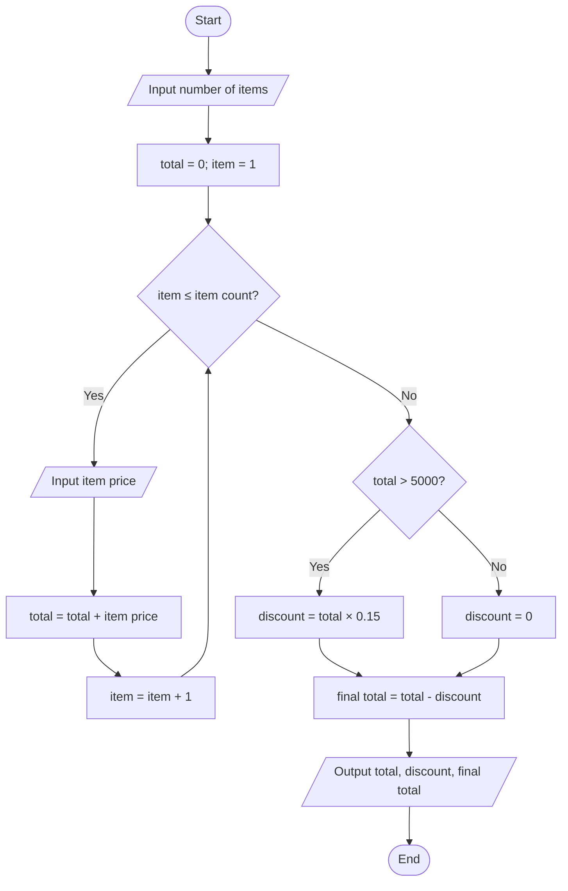

## 16. Electricity Bill Calculator

This uses progressive rates: the first 100 units cost 1.5 SEK each, the next 200 cost 2.0 SEK each, and units above 300 cost 3.0 SEK each. Input is assumed to be non-negative.

### ✔ Pseudocode

```text
START
    INPUT units
    IF units ≤ 100 THEN
        bill ← units × 1.5
    ELSE IF units ≤ 300 THEN
        bill ← (100 × 1.5) + ((units - 100) × 2.0)
    ELSE
        bill ← (100 × 1.5) + (200 × 2.0) + ((units - 300) × 3.0)
    ENDIF
    OUTPUT bill
END
```

### ✔ Flowchart

```mermaid
flowchart TD
    A([Start]) --> B[/Input units consumed/]
    B --> C{units ≤ 100?}
    C -->|Yes| D[bill = units × 1.5]
    C -->|No| E{units ≤ 300?}
    E -->|Yes| F[bill = 100 × 1.5 + (units - 100) × 2.0]
    E -->|No| G[bill = 100 × 1.5 + 200 × 2.0 + (units - 300) × 3.0]
    D --> H[/Output bill in SEK/]
    F --> H
    G --> H
    H --> I([End])
```
